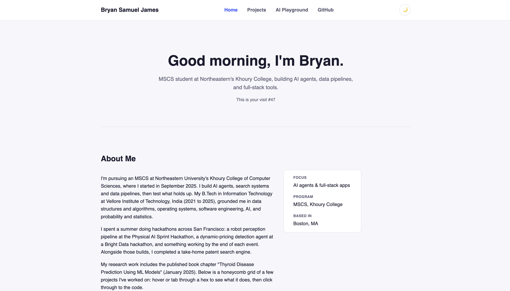

# Bryan Samuel James: Vanilla Homepage

## Author

Bryan Samuel James, [github.com/BryanSJamesDev](https://github.com/BryanSJamesDev) · [LinkedIn](https://linkedin.com/in/bryan-james-1530891b3)

## Class Link

<!-- TODO: replace with your actual Canvas/course page URL -->

[Course page](https://northeastern.instructure.com/courses/261032)

## Project Objective

A framework-free personal homepage built with vanilla HTML5, CSS3, and ES6
modules: no backend, no component libraries, no jQuery, for a web
development course assignment. The page introduces me and links out to a
handful of my software projects through an interactive honeycomb grid, the
site's creative/differentiating feature.

## Screenshot

<!-- TODO: replace with a real screenshot once deployed, e.g. images/screenshot.png -->



## Live Site

<!-- TODO: replace with your GitHub Pages URL once deployed -->

https://bryansjamesdev.github.io/bryan-vanilla-homepage/

## Pages

- `index.html`: homepage with hero, about section, and the honeycomb project grid
- `projects.html`: a project-by-project breakdown as a responsive card grid
- `ai-generated.html`: clearly labeled AI-generated companion page (see below)

## Project Structure

```
.
├── index.html
├── projects.html
├── ai-generated.html
├── css/
│   ├── styles.css        # shared layout, header, hero, honeycomb, footer
│   ├── projects.css      # Projects page grid
│   └── ai-generated.css  # AI Playground page styling
├── js/
│   ├── main.js           # ES6 module entry point
│   ├── theme.js          # dark/light theme toggle (localStorage)
│   ├── greeting.js       # time-of-day greeting + visit counter
│   └── honeycomb.js      # hex-grid hover/focus captions
├── images/
├── package.json
├── eslint.config.js
├── .prettierrc.json
└── LICENSE
```

## Instructions to Build / Run Locally

No build step is required, this is a static site.

1. Clone the repo:
   ```bash
   git clone https://github.com/BryanSJamesDev/bryan-vanilla-homepage.git
   cd REPLACE_ME
   ```
2. Install dev dependencies (Prettier + ESLint, used only for linting/formatting):
   ```bash
   npm install
   ```
3. Open `index.html` directly in a browser, or serve it locally:
   ```bash
   npx serve .
   ```
4. Check formatting and lint before committing:
   ```bash
   npm run format
   npm run lint
   ```

## Deployment

Deployed as a static site via GitHub Pages (Settings → Pages → deploy from
the `main` branch, root folder).

## Use of Generative AI

I used Claude (Anthropic), specifically **Claude Sonnet 5**, through the Claude app as a development assistant during this project. I mainly used it for targeted suggestions, reference examples, and troubleshooting when I had specific implementation questions. I made the final design, coding, integration, testing, and submission decisions myself.

- **Project structure and implementation guidance**: I used Claude as a reference when deciding how to organize the project files. One representative prompt was: `"What's a simple way to organize separate HTML, CSS, and ES6 JavaScript files in a small vanilla web project?"` I used the response as general guidance while organizing and building the final site myself.
- **Honeycomb project grid**: I used Claude to understand a CSS technique that could be used for the hexagonal project layout. One representative prompt was: `"What CSS technique can be used to create a hexagon shape with clip-path?"` I used the technique as a reference and implemented the final interlocking grid layout, project content, spacing, sizing, styling, and interactions for my homepage.
- **JavaScript guidance**: I used Claude for targeted troubleshooting related to specific JavaScript behavior. One representative prompt was: `"Why isn't my localStorage theme preference persisting after reload?"` I reviewed and adapted the relevant logic, organized the final functionality into ES6 modules, connected the modules through `main.js`, and tested the final interactions myself.
- **AI-generated page**: For `ai-generated.html`, I intentionally used Claude to generate some of the written content. One prompt used was: `"Write a short, dry-humor bio blurb and three fun facts about a CS grad student who does a lot of hackathons."` I made light edits to the generated text. This page is clearly labeled as AI-generated as part of the assignment requirement.
- **Tooling and troubleshooting**: I used Claude for troubleshooting help when working with development tools. One representative prompt was: `"What should I check when ESLint reports an error in a vanilla ES6 project?"` I ran ESLint and Prettier locally, reviewed the results, and made the necessary corrections myself.

The final site's visual design, page structure, navigation, content about me and my projects, project selection, styling decisions, honeycomb customization, ES6 module organization, integration, testing, validation, content verification, and final code review were completed by me. Any AI-generated suggestions were reviewed and adapted before being included in the submitted project.
